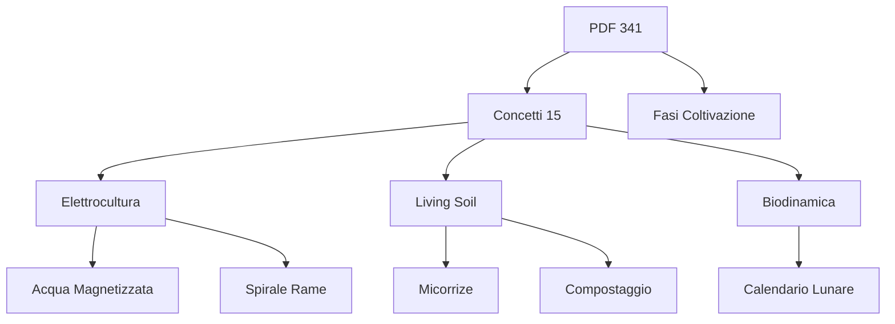

# BioSerra — Knowledge Base Overview

```markdown
# **BioSerra Wiki**
*Living Soil Outdoor, Water-Only, Biodinamica & Elettrocultura*
**Location:** Caserta (41°N) | **Sistema:** Suolo Vivente + Energia Naturale

---

## **🌱 Filosofia BioSerra**
BioSerra è un ecosistema agricolo **olistico** che integra:
- **Living Soil**: Suolo vivo ricco di microrganismi, materia organica e minerali biodisponibili.
- **Water-Only**: Irrigazione con acqua strutturata (magnetizzata, dinamizzata) per massimizzare l’assorbimento radicale.
- **Biodinamica**: Rispetto dei ritmi lunari, cosmici e stagionali per armonizzare crescita e resilienza.
- **Elettrocultura**: Tecniche passive/attive (Lakhovsky, Fe-Cu, spirali rame, antenna terra) per stimolare la vitalità cellulare e la resistenza delle piante.

**Visione:** Coltivare piante in **sinergia con la natura**, eliminando input chimici e sfruttando le forze naturali per produrre biomassa rigogliosa e principi attivi potenziati.

---

## **📚 Sistema di Conoscenza**
BioSerra si basa su:
- **341 PDF** (guide pratiche, studi scientifici, esperienze locali).
- **15 concetti attivi** (categorie tematiche interconnesse).
- **Rete di rimandi** tra documenti, tecniche e principi.

**Struttura:**


**Esempio di integrazione:**
- Un PDF su [germinazione]([web_zamn_284-germinare-semi-con-lo-smart-start]) cita l’uso di **acqua magnetizzata** ([concept:Acqua Magnetizzata]) e il **calendario lunare** ([concept:Calendario Lunare]) per ottimizzare i tempi.

---

## **⚡ Tecniche di Elettrocultura Attive**
| Tecnica               | Descrizione                                                                 | Pagina Wiki |
|-----------------------|-----------------------------------------------------------------------------|-------------|
| **Acqua Magnetizzata** | Acqua trattata con campi magnetici per migliorare idratazione e assorbimento. | [[elettrocultura/acqua-magnetizzata]] |
| **Spirale in Rame**    | Spirali di rame posizionate intorno alle piante per stimolare la crescita.  | [[elettrocultura/spirale-rame]] |
| **Circuito di Lakhovsky** | Circuito oscillante (rame/ottone) per armonizzare le frequenze cellulari. | [[elettrocultura/lakhovsky]] |
| **Elettrodi Fe-Cu**    | Coppie di elettrodi ferro/rame nel suolo per generare correnti bioelettriche. | [[elettrocultura/fe-cu]] |
| **Antenna di Terra**   | Sistema di messa a terra per scaricare tensioni statiche e armonizzare il suolo. | [[elettrocultura/antenna-terra]] |

**Nota:** Tutte le tecniche sono **passive** (nessun consumo energetico) e si integrano con il **Living Soil**.

---

## **🌍 Principi Living Soil**
### **1. Microbioma del Suolo**
- **Funghi micorrizici**: Simbiosi con le radici per aumentare l’assorbimento di nutrienti.
- **Batteri benefici**: Decompositori (es. *Pseudomonas*, *Bacillus*) che mineralizzano la materia organica.
- **Protozoi e nematodi**: Regolano la popolazione microbica.

### **2. Minerali Biodisponibili**
- **Farine di rocce** (basalto, zeolite, calcare) per apporto lento di silicio, calcio, magnesio.
- **Compost maturo**: Fonte di carbonio, azoto e micronutrienti.